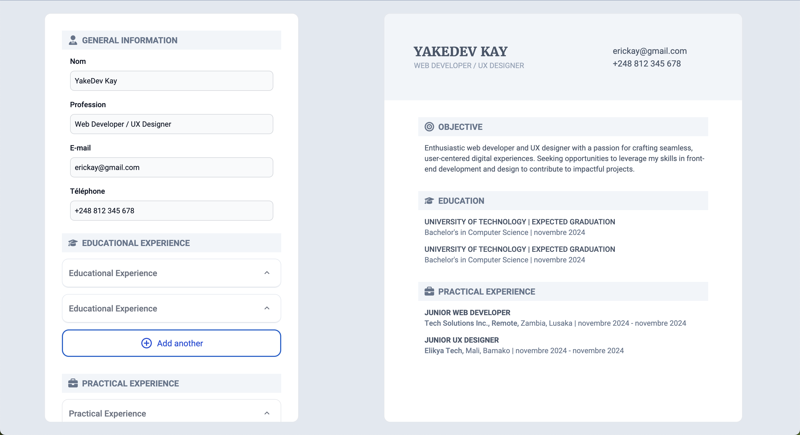

# CV Application Creator

The **CV Application Creator** is an interactive web application, built with **React**, that allows users to easily create a CV online. This project, my first in React, is designed for beginners looking to generate a professional CV without needing complex software.

## Screenshot

## Features

- **User-friendly input**: Users can enter personal information, professional background, skills, and education.
- **Real-time preview**: Instantly preview changes made to the CV.
- **Auto-save functionality**: Using **localStorage**, all data is saved automatically and retained even after closing the browser.
- **PDF export**: Download the finished CV, ready to be printed or shared.

## Technologies Used

- **Frontend**: React, JavaScript, HTML, CSS
- **Storage**: localStorage for retaining data between sessions

## Learning Objectives

- Master the basics of React to create dynamic components.
- Use **localStorage** to enhance the user experience by implementing an auto-save feature.
- Deepen my skills in **JavaScript** and **CSS** to build engaging user interfaces.

Explore the **CV Application Creator** and create your professional CV in just a few simple steps!
